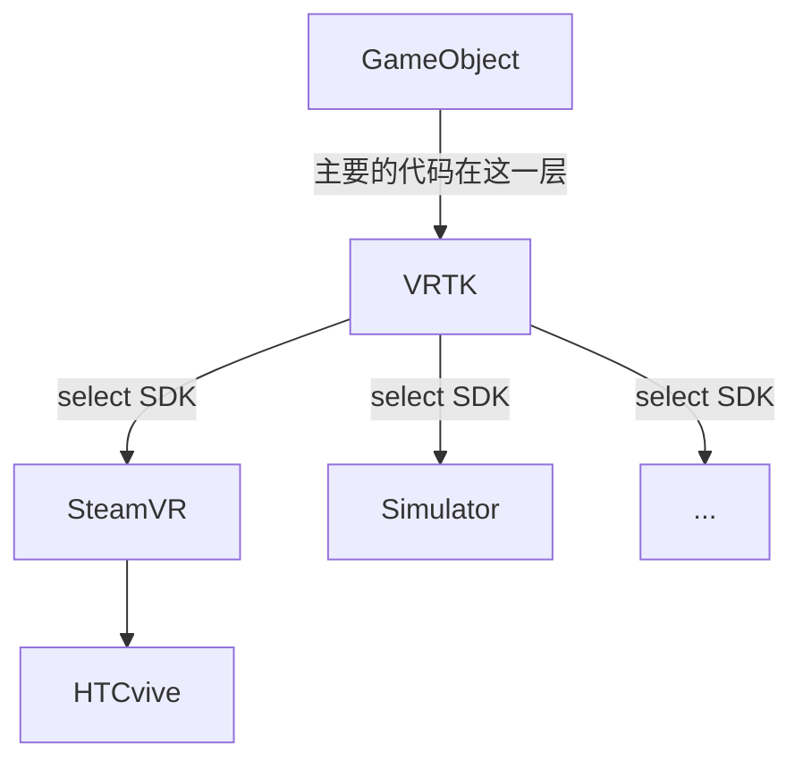

# VR使用指南

## 架构介绍

目前打算采用HTC vive作为VR设备，HTC Vive硬件设备可以使用SteamVR进行连接（可以在Steam商店中下载），Unity中的SteamVR包可以与SteamVR软件进行交互，从而实现Unity与硬件的交互。

VRTK可以把多种VR设备的操纵整合在一起，使用VRTK编程可以适配在多种VR设备上。所以编程主要是面向VRTK进行。VRTK中有一个SDK是**simulator**，可以在没有VR设备的情况下进行调试，但操作很麻烦。

## 操作指南

- 右上角可以选择使用的SDK，选择**Simulator**
- 红点和蓝点代表两个手柄，按下**alt**可以切换操纵头盔还是手柄，按下**tab**可以切换左右手
- 按下**Q**可以从手柄中投射出一条射线，松开后传送的射线指向的位置

## 参考资料

- [VRTK Youtube教程](https://www.youtube.com/channel/UCWRk-LEMUNoZxUmY1wO7DBQ/featured)
- [使用VRTK在场景中实现传送](https://blog.csdn.net/a514335188/article/details/72595206)

